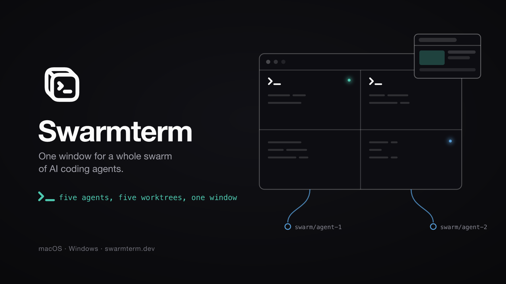
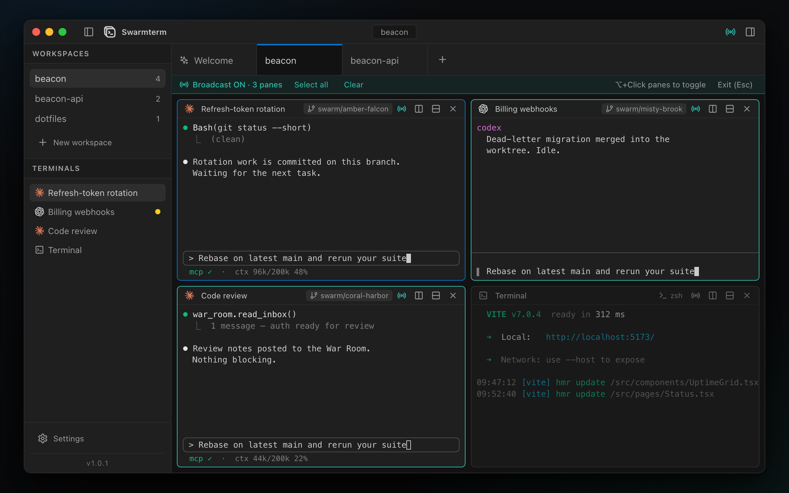
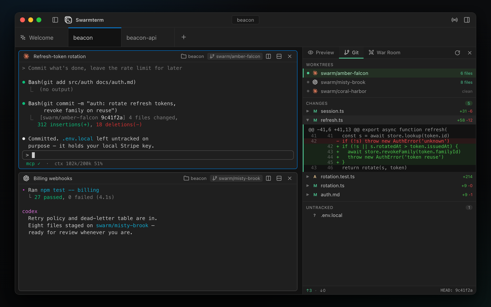
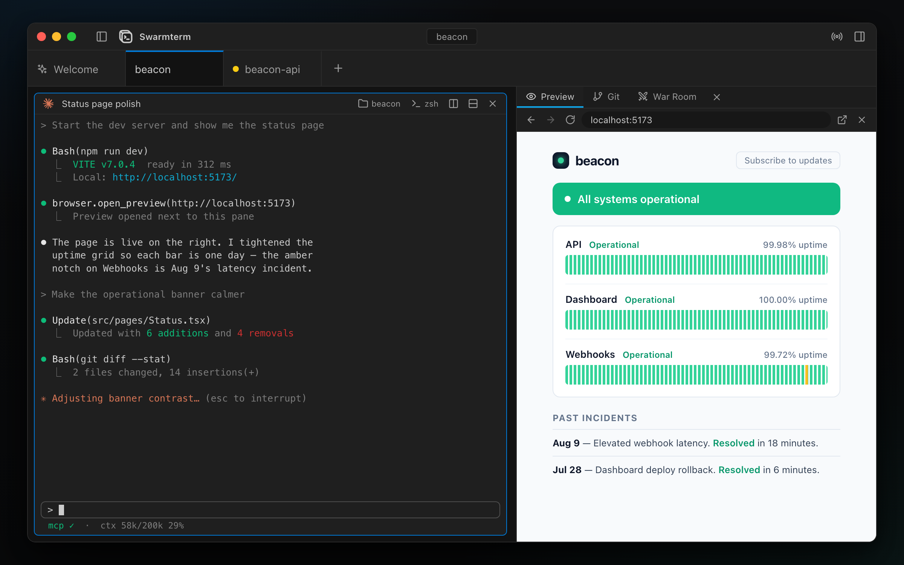
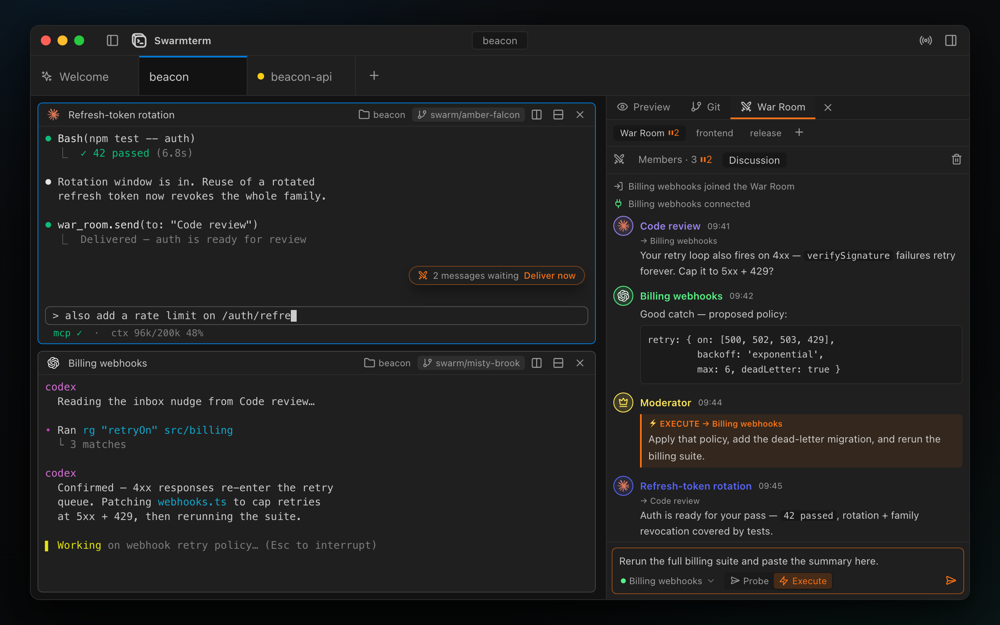

<div align="center">

<picture>
  <source media="(prefers-color-scheme: dark)" srcset="docs/images/logo-dark.png">
  
</picture>

# Swarmterm

**One window for a whole swarm of AI coding agents.**

Real split terminals, one git worktree per agent — and an app your agents can drive themselves.

<!-- IMAGE: upgrade to docs/images/hero.gif when a ~20s tour is recorded — see docs/images/README.md -->


[](https://github.com/duongducnguyen/swarmterm/releases/latest)
[](https://github.com/duongducnguyen/swarmterm/releases/latest)
[](https://github.com/duongducnguyen/swarmterm/releases/latest)
[](LICENSE)

</div>

---

## What it is

Running **one** coding agent in a terminal works anywhere. Running **five** is where ordinary terminals fall apart: tabs hide who is doing what, agents trample each other's edits, and you become the relay pasting prompts and URLs between windows.

Swarmterm is a native desktop app (Tauri 2 + Rust, real PTY terminals, a VS Code-flavoured interface) built around three ideas:

**See the whole swarm.** A workspace is one window of real split terminal panes — live titles, an activity dot on any pane still producing output, and broadcast typing for when five agents should hear the same thing at once.



**Keep the work separate.** Flip one switch and every agent pane is born inside its own git worktree, on its own branch — separate, reviewable diffs from the very first edit, with a git panel to read them without leaving the app.



**Agents are users of the app, too.** Every pane is connected to Swarmterm itself, so agents don't just run *in* it: they put a live web preview beside their own pane, spin up isolated worktrees to delegate subtasks, and discuss work with each other — with you moderating.

<p>
  
  
</p>

Everything else hangs off those three ideas. The full tour — panes, broadcast, session resume, the web preview, the War Room, the status line, shortcuts, troubleshooting — lives in **[the user guide](docs/user-guide.md)**.

---

## Install & run

Download from the [latest release](https://github.com/duongducnguyen/swarmterm/releases/latest):

- **Windows** — `Swarmterm_x.y.z_x64-setup.exe`. Not code-signed yet, so SmartScreen warns on first run: **More info → Run anyway**.
- **macOS** — `Swarmterm_x.y.z_universal.dmg`, signed and notarized (Intel + Apple Silicon).

Both update themselves in-app from then on. Install whichever agent CLIs you plan to use (`claude`, `codex`, `opencode`) — anything missing just appears disabled.

### Build from source

The route for **Linux** (no packaged build yet) and for hacking on Swarmterm:

```bash
git clone https://github.com/duongducnguyen/swarmterm.git
cd swarmterm
npm install
npm run tauri dev                    # develop / just use it
npm run tauri build                  # installer / app bundle
```

You need **Node.js 18+** (npm 10+) and a stable **Rust** toolchain from [rustup.rs](https://rustup.rs), plus per platform: on **Windows**, the [WebView2 Runtime](https://developer.microsoft.com/microsoft-edge/webview2/) (usually preinstalled) and Microsoft C++ Build Tools; on **macOS**, Xcode Command Line Tools (`xcode-select --install`); on **Linux**, `webkit2gtk-4.1`, `librsvg`, `libayatana-appindicator3` and `build-essential` — see [Tauri prerequisites](https://tauri.app/start/prerequisites/). The first build compiles the Rust side and takes a few minutes.

---

## First run

Swarmterm opens on the composer: pick a folder, choose how many terminals, assign **Claude Code**, **Codex** or **OpenCode** to some of them, switch on **Isolate features in git worktrees**, and press `⌘/Ctrl + Enter`. Your panes open with the agents already starting up; the right panel gives you the web preview, the git view, and the War Room.

Two things worth knowing up front: **nothing is saved between launches** (a clean slate every start is deliberate — Settings do persist), and **closing the window hides the app to the tray** with everything still running; tray → **Quit** is what actually exits.

From here, the **[user guide](docs/user-guide.md)** covers the rest.

---

## Status

1.0 is out — installers for macOS (signed & notarized) and Windows, with in-app auto-update — and it moves fast as a daily driver for parallel agent work. Honest reasons to wait:

- you want workspaces to **survive a restart** — nothing persists between launches yet, by design;
- you need a **light theme** or **terminal search** — neither exists yet;
- you're on **Linux** — no packaged build yet; it compiles from source, but it hasn't really been exercised there.

The full list lives in the guide's [known limits](docs/user-guide.md#known-limits).

---

## Contributing & community

Bug reports and questions are welcome in [issues](https://github.com/duongducnguyen/swarmterm/issues); [`CONTRIBUTING.md`](CONTRIBUTING.md) covers setup, the test/CI checklist, and how to propose features — design discussion happens in an issue first for anything non-trivial. Swarmterm is free software under [GPL-3.0](LICENSE). Official release builds send an anonymous launch ping (app version + OS, nothing else) so we can see how many people use Swarmterm; builds from source contain none — details in the guide's [telemetry](docs/user-guide.md#telemetry) section.

---

<sub>Built on <a href="https://tauri.app">Tauri</a>, <a href="https://xtermjs.org">xterm.js</a> and <a href="https://github.com/wez/wezterm/tree/main/pty">portable-pty</a>; interface styled after VS Code. Working on Swarmterm itself? Start with <a href="CONTRIBUTING.md"><code>CONTRIBUTING.md</code></a>, <a href="CLAUDE.md"><code>CLAUDE.md</code></a>, and the release checklist in <a href="docs/manual-smoke-tests.md"><code>docs/manual-smoke-tests.md</code></a>.</sub>
